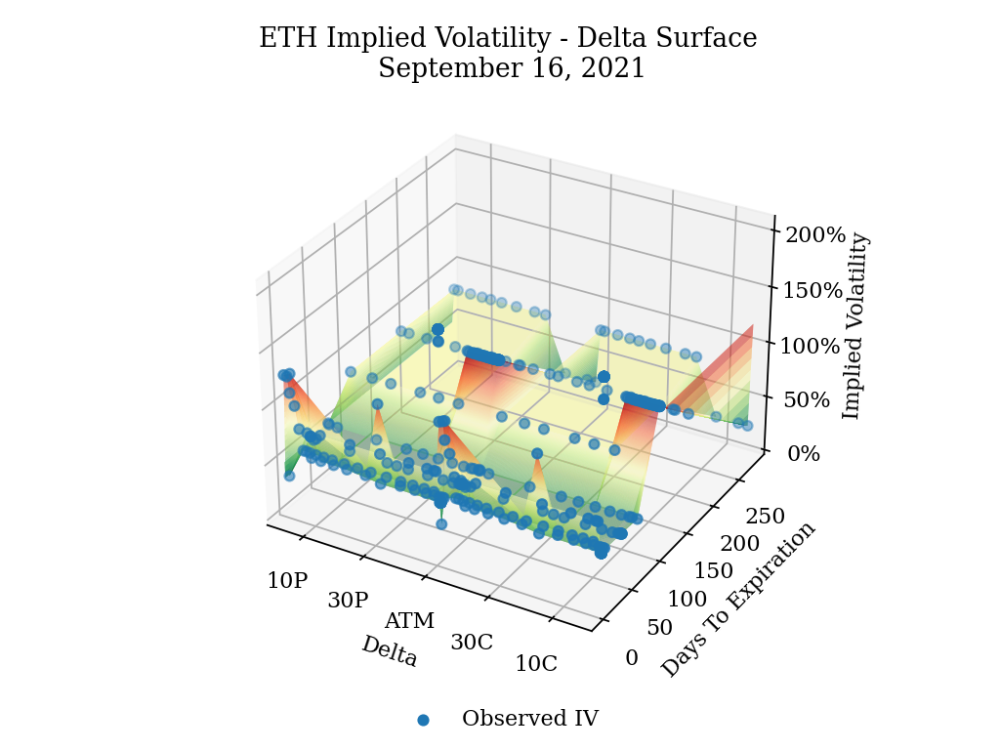

# Spot Derivatives Analysis Results Report

#### Last Update September 14, 2021 ####
#### Matteo Bottacini, [matteo.bottacini@usi.ch](mailto:matteo.bottacini@usi.ch) ####

## Project description
In this report are show the results obtained for the Spot Cryptocurrency Derivatives Market.

The codes described are in [`../deliverables/run-spot-analysis.py`](../deliverables/run-spot-analysis.py) which is the only script you need to run to perform the analysis. The images are in [`../reports/images`](../reports/images).

Note: all the images in this GitHub repo are `.png` instead of `.pdf`. The reason is to make it easier for GitHub to render the results.

## Table of contents

1. [Create the Environment: directories and sub-directories](#create-the-environment-directories-and-sub-directories)
2. [Data Pre-processing](#data-pre-processing)   
3. [Implied Volatility Smile](#implied-volatility-smile) 
4. [Implied Volatility Surface and ATM Term-Structure](#implied-volatility-surface-and-atm-term-structure)
5. [Greeks: Surface and ATM term-structure](#greeks-surface-and-atm-term-structure)
6. [Implied Volatility-Delta Surface](#implied-volatility-delta-surface)


## Create the Environment: directories and sub-directories
The first step is to create the environment to store the results using the self-function `create_env()`

```python
# import modules
from SpotAnalysis.src.utils import *

# create environment
create_env(local_folder='deliverables')
```

### Data Pre-processing:
The second step is to preprocess the data for both `BTC` and `ETH` using the self-function `data_preprocessing() and store the results.

```python
# import modules
from SpotAnalysis.src.utils import *

# preprocessing data
btc_df = data_preprocessing(coin='BTC')
eth_df = data_preprocessing(coin='ETH')
```

## Implied Volatility Smile
The third step is to inspect the first stylized fact of Options: implied volatility smile. We want to look at the smiles of options with the closest expiry to 90 days.
We do this operation for both `BTC` and `ETH`.

Note: if you want to look at different expires change the variable `90` in `time_to_maturity=90` to the maturity of choice.

```python
# import modules
from SpotAnalysis.src.utils import *

# iVol Smile plots - 3 months to maturity
iv_smile(coin_df=btc_df, coin='BTC', time_to_maturity=90, cwd='deliverables')
iv_smile(coin_df=eth_df, coin='ETH', time_to_maturity=90, cwd='deliverables')
```

Thus, we obtained these two smiles:


## Implied Volatility Surface and ATM term-structure
The fourth step consists in analyzing the Implied Volatility Surface and the ATM implied volatility term-structure.
We do this operation for both `BTC` and `ETH`. The function to perform is: `implied_vol()`.

```python
# import modules
from SpotAnalysis.src.utils import *

# iVol Surface and ATM term structure
implied_vol(coin_df=btc_df, coin='BTC', cwd='deliverables')
implied_vol(coin_df=eth_df, coin='ETH', cwd='deliverables')
```

The `BTC` surfaces are estimated with a (i) nearest interpolation, (ii) linear interpolation, (iii) cubic interpolation.
Here are the results:


And the `BTC` ATM implied volatility term-structure estimated with (i) nearest interpolation, (ii) linear interpolation, (iii) cubic interpolation are:


For `ETH` the surfaces estimated with (i) nearest interpolation, (ii) linear interpolation, (iii) cubic interpolation are:


And the `ETH` ATM implied volatility term-structure estimated with (i) nearest interpolation, (ii) linear interpolation, (iii) cubic interpolation are:


## Greeks: Surface and ATM term-structure
The fifth step is to analyze the surface of some greeks (`Delta`, `Gamma`, `Rho`, `Theta`) and their ATM term-structure for both `BTC` and `ETH`.
The function is `greeks()`:

```python
# import modules
from SpotAnalysis.src.utils import *

# Greeks Surface and ATM term structure
greeks(coin_df=btc_df, coin='BTC', cwd='deliverables')
greeks(coin_df=eth_df, coin='ETH', cwd='deliverables')
```

The `BTC` greeks surfaces are:


The `BTC` Greeks ATM term-structure are:


While the `ETH` Greeks surfaces are:


And the `ETH` Greeks ATM term structure are:


## Implied Volatility-Delta Surface
The sixth and last step is to evaluatue the Implied Volatility Delta-Surface for both `BTC` and `ETH`. The function that performs the task is:

```python
# import modules
from SpotAnalysis.src.utils import *

# iVol Delta Surface
iv_delta_surface(coin_df=btc_df, coin='BTC', cwd='deliverables')
iv_delta_surface(coin_df=eth_df, coin='ETH', cwd='deliverables')
```

The `BTC` iVol-Delta surface is:


The `ETH` iVol-Delta surface is:

